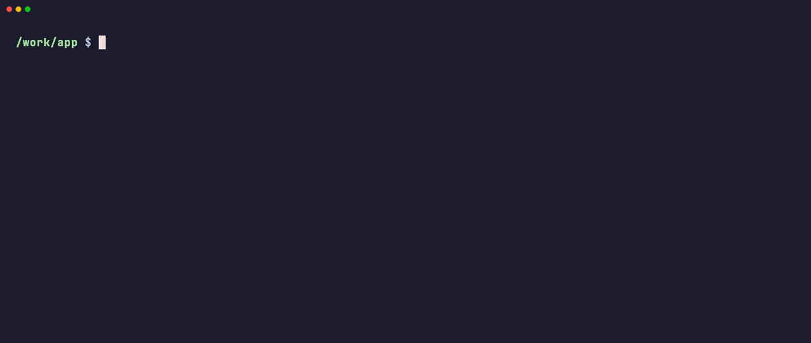
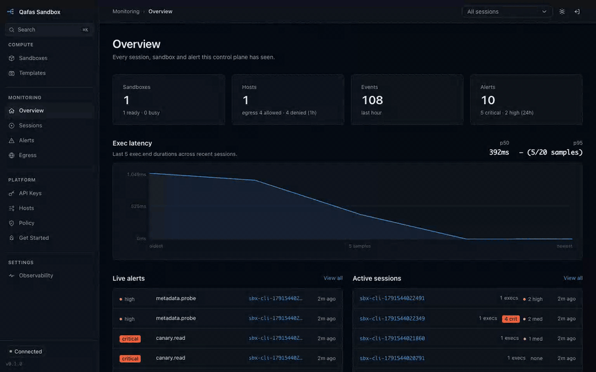

# Qafas Sandbox

*Qafas* (قفص) is Arabic for "cage". Qafas Sandbox is a fast, secure execution sandbox for LLM coding agents that you run **on your own hardware**: the agent's commands run in a sandbox with deny-by-default egress, a browser, a timeline of every process and network call, and security alerts — while the agent and its API keys stay outside.

Built for **air-gapped and on-prem** sites at a fixed, declared scale: one control plane and a handful to a few dozen worker hosts. No cloud dependency, no phone-home; every artifact can be carried in.

**Status: alpha.** The API contract (`docs/protocol.md`) is stable enough to build on; see [Known limits](#known-limits).

## How it fits together

```
 coding agents, sbx CLI, SDKs ──► control plane (server)  :7800   dashboard, API, alerts, SQLite
            │                            │
            │ exec, files, shell         │ create / destroy / metrics
            ▼                            ▼
          worker (agent)  :7700   qafas daemon on each host ──► sandboxes
                                  native · vm (Docker or podman) · remote (Firecracker microVMs)
```

A **worker** (`qafas`) runs the sandboxes on its own host; the **control plane** places them, keeps the history and serves the dashboard. Clients talk to the control plane to create a sandbox, then to the worker directly to use it. On a single machine both run side by side.

| tier | boundary | when |
|---|---|---|
| `native` | OS sandbox (Seatbelt / Landlock + bwrap), shared kernel, < 1 ms | fast iteration on trusted code, a developer's own machine |
| `vm` | container with a private rootfs, ~3 ms per exec | general purpose; untrusted code |
| `remote` | Firecracker microVM on Linux/KVM, ~20 ms per exec | highest isolation; shared hosts |

Every sandbox has a size it cannot raise — `micro` (0.5 CPU, 512 MiB), `mini` (1, 1 GiB), `medium` (2, 2 GiB, the default), `high` (4, 4 GiB) — and `trust: untrusted` never runs on `native`.

## Quick start: one machine

Control plane and worker on one Linux host (x86_64 or arm64; validated on Ubuntu 24.04, Linux Mint 22 and Rocky Linux 9; 4 CPUs and 8 GB RAM are plenty to try it). Pick **A** or **B**; **C** is a macOS developer machine.

### A. Packages (Ubuntu, Mint, RHEL, Rocky)

```sh
V=0.1.0                                     # x-release-please-version
R=https://github.com/exitCodeNihil/qafas-sandbox/releases/download/v$V

# Debian, Ubuntu, Mint
A=$(dpkg --print-architecture)              # amd64 | arm64
curl -fLO $R/qafas-controlplane_$V-1_$A.deb -fLO $R/qafas_$V-1_$A.deb -fLO $R/qafas-cli_$V-1_all.deb -fLO $R/SHA256SUMS
sha256sum --ignore-missing -c SHA256SUMS
sudo apt install ./qafas-controlplane_$V-1_$A.deb ./qafas_$V-1_$A.deb
sudo apt install ./qafas-cli_$V-1_all.deb           # optional, needs Node.js 22 (below)

# RHEL, Rocky, Alma
A=$(uname -m)                               # x86_64 | aarch64
curl -fLO $R/qafas-controlplane-$V-1.$A.rpm -fLO $R/qafas-$V-1.$A.rpm -fLO $R/qafas-cli-$V-1.noarch.rpm -fLO $R/SHA256SUMS
sha256sum --ignore-missing -c SHA256SUMS
sudo dnf install ./qafas-controlplane-$V-1.$A.rpm ./qafas-$V-1.$A.rpm
sudo dnf install ./qafas-cli-$V-1.noarch.rpm         # optional, needs Node.js 22 (below)
```

That is the whole setup. `qafas-controlplane` is the server (dashboard, API, tokens minted on install), `qafas` is the worker (it uses Docker if the host has it, otherwise installs podman), and on one machine the worker joins the control plane by itself. `qafas-cli` is the `sbx` command and needs Node.js 22, which Ubuntu 24.04 and RHEL 9 don't ship by default (Ubuntu/Mint: [NodeSource](https://github.com/nodesource/distributions); RHEL 9: `dnf module enable nodejs:22`) — or skip it and use the container alias from **B**.

```sh
systemctl status controlplane qafas --no-pager
sudo journalctl -u qafas -n 20 --no-pager           # "serving" with tiers ["vm"]; the first start pulls the ~1.4 GB guest image
export SBX_URL=http://127.0.0.1:7800 SBX_ADMIN_TOKEN=$(sudo sed -n 's/^SBX_ADMIN_TOKEN=//p' /etc/controlplane/env)
```

### B. Docker

Needs Docker Engine 26 or later with the compose plugin (`apt install docker.io docker-compose-v2`, or [Docker's packages](https://docs.docker.com/engine/install/)). podman works too: set `CONTAINER_SOCK=/run/podman/podman.sock` in `.env`.

```sh
V=0.1.0                                     # x-release-please-version
G=https://raw.githubusercontent.com/exitCodeNihil/qafas-sandbox/v$V/deploy/docker
mkdir qafas && cd qafas
curl -fLO $G/compose.yml && curl -fL $G/.env.example -o .env
for t in SBX_ADMIN_TOKEN SBX_HOST_TOKEN SBX_TOKEN_SECRET; do sed -i "s/^$t=.*/$t=$(openssl rand -hex 24)/" .env; done
sudo docker compose up -d
sudo docker compose logs -f qafas                    # wait for "egress proxy container up"; the first start pulls the guest image

export SBX_URL=http://127.0.0.1:7800 SBX_ADMIN_TOKEN=$(sed -n 's/^SBX_ADMIN_TOKEN=//p' .env)
alias sbx='sudo docker run --rm -it --network host -e SBX_URL="$SBX_URL" -e SBX_ADMIN_TOKEN="$SBX_ADMIN_TOKEN" -e SBX_API_KEY="$SBX_API_KEY" -v "$PWD:$PWD" -w "$PWD" ghcr.io/exitcodenihil/qafas-sandbox/sbx:'$V
```

The worker mounts `/home` and `/root` at the same paths so it can see who owns a working directory; add any other directory people work in to `compose.yml`.

### C. macOS, from source

```sh
make tools machine                 # Rust targets, zig, and a podman machine with 6 vCPU / 8 GB
make guest-agent image qafas web cp sdk
make dev-local                     # control plane :7800 + worker :7700, native and vm tiers, in the foreground
export SBX_URL=http://localhost:7800 SBX_ADMIN_TOKEN=admin      # in another terminal
```

### Your first sandbox



Open the dashboard at `http://<this host>:7800` and sign in with `SBX_ADMIN_TOKEN`; **Hosts** shows the worker and its capacity. From the same machine:

```sh
sbx doctor                                   # can reach the control plane, which tiers are up
sbx run -- 'uname -a; id; python3 --version' # a throwaway sandbox: create, run, destroy
sbx shell --keep                             # an interactive shell that outlives your session
sbx ls                                       # every sandbox the control plane knows
sbx events <sandbox_id> --follow             # its process, file and network timeline
```

Inside: your current directory at the **same absolute path**, a Debian userland (git, curl, ripgrep, python3 + uv, node 22, headless Chromium), no network except what `/etc/qafas/egress.json` allows (`curl https://example.com` works, `curl https://google.com` is refused by the proxy), and the size's CPU, memory, disk and process limits.

The dashboard keeps every sandbox's process, file and network timeline, each allow and deny the egress proxy decided, and the alerts — here a sandbox reading the planted `~/.aws/credentials` and probing the cloud metadata address:



To hand access to people or agents, create an **API key** in the dashboard (pick the sizes and tiers it may use) and give them `SBX_API_KEY` instead of the admin token. Coding agents plug in through `sbx mcp` or the snippets in `deploy/harnesses/` — see the [TypeScript SDK README](sdk/ts/README.md).

## Next

| | |
|---|---|
| [docs/deployment.md](docs/deployment.md) | production: separate servers and agents, network and firewall rules, OS permissions, TLS, Firecracker workers, upgrades, backups, monitoring |
| [docs/airgap.md](docs/airgap.md) | installing in a datacenter with no internet, including micro-segmented networks and private registries |
| [TypeScript / JavaScript](sdk/ts/README.md) · [Python](sdk/python/README.md) · [Go](sdk/go/README.md) · [Rust](sdk/rust/README.md) · [Java](sdk/java/README.md) | the SDKs (one package per language, released with the server), the `sbx` CLI, the MCP server and coding-agent integration |
| [SECURITY.md](SECURITY.md) · [docs/security.md](docs/security.md) | reporting a vulnerability · every control in place and every one knowingly deferred |
| [docs/protocol.md](docs/protocol.md) · [docs/decisions.md](docs/decisions.md) | the API contract · why things are the way they are (for contributors) |

## Known limits

- One control plane with SQLite; no high availability yet. Back up its database (docs/deployment.md).
- The Linux `native` tier is compile-checked only; `vm`, `remote` and macOS `native` are tested end to end.
- Scratch disk on `vm` and `remote` is RAM-backed, so `disk_mib` is bounded by memory in effect; the mounted workspace has no quota.
- A Firecracker guest keeps its template's RAM; a size above it is refused (`[firecracker] mem_mib`).
- On Docker a sandbox runs as its workspace's owner (Docker has no idmapped mounts), so the workspace must already exist and belong to a regular user; a root-owned one is refused.

## Releases

[Releases](https://github.com/exitCodeNihil/qafas-sandbox/releases) carry the packages, the Firecracker bundle, `images.txt` (every image a version runs) and the scripts that save those images for an air-gapped site; `CHANGELOG.md` says what changed.

## Building from source

`make tools` · `make guest-agent qafas qafas-linux image rootfs cp web sdk` · `make test` · `make dev-local` · `make bench` · `scripts/package.sh <version>` (deb/rpm). Contributors start with `CLAUDE.md`.

## License

MIT — see `LICENSE`.
